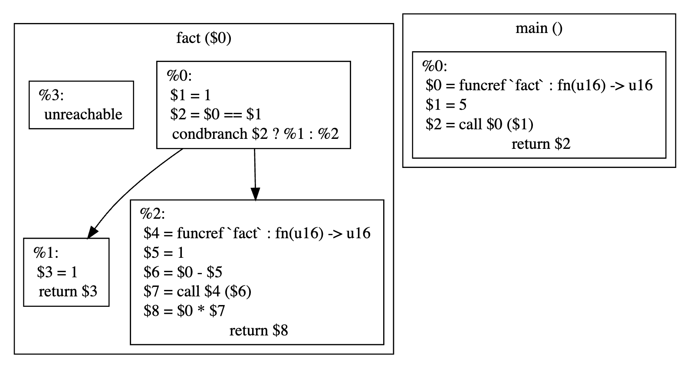

## Delta Null

An ongoing, heavily WIP, project to
**create an embedded project, as close to "from scratch" as you can get**.
This comprises:

- A **16-bit RISC processor core design**, implemented as:
  - A **soft-core targeting the [TinyFPGA BX](https://tinyfpga.com/)**, written using [Amaranth HDL](https://github.com/amaranth-lang/amaranth), and
  - A software emulator
- An **assembler**
- A **compiler for a low-level programming language**, producing assembly

The end result will _probably_ be a simple calculator, since I've
[made](https://github.com/AaronC81/delta-m0)
[some](https://github.com/AaronC81/delta-pico)
[before](https://github.com/AaronC81/delta-radix),
but we'll see where we go!

## Progress

The processor core design is largely complete, besides a hardware BCD extension which will come
later.

The gateware implementation is functional, though poorly optimised, making no use of pipelining.
This would be a nice improvement in future.

The assembler works great, but the compiler is still very early in development, and not particularly
useful yet.

## Showcase

### Architecture/Assembly Language

The Delta Null's instruction set and assembly language are closely linked: one opcode corresponds to
one instruction encoding. There are eight general-purpose registers, `r0`-`r7`, and a small set of
special-purpose registers.

The assembler provides some macros (prefixed with `.`) to make some operations more convenient, such
as initialising a register.

The below example implements an LED blink on the TinyFPGA BX gateware, which maps some hardware
control peripherals to the `0xF000` region.

```
; set built-in LED to output
.put r1, 0xF010
.put r2, 0x0001
write r1, r2

blink:

    ; busy-wait
    .put r2, 0xFFFF ; r2 = counter
    loop:
        dec r2
        eqz r2
        inv
        cjmpoff loop/offset

    ; toggle LED
    .put r1, 0xF012
    read r2, r1
    not r2
    write r1, r2

    ; repeat
    jmpoff blink/offset
```

### Emulator

The emulator has a nifty terminal-based user interface:

```
┌Instructions────────────────────────────┐┌GPRs───┐┌SPRs───┐
│> 0000 1110 putl r1, 16                 ││r0 0000││ip 0000│
│  0001 19f0 puth r1, 240                ││r1 0000││rp 0000│
│  0002 1201 putl r2, 1                  ││r2 0000││sp ffff│
│  0003 1a00 puth r2, 0                  ││r3 0000││ef 0000│
│  0004 2092 write r1, r2                ││r4 0000││       │
│  0005 12ff putl r2, 255                ││r5 0000││       │
│  0006 1aff puth r2, 255                ││r6 0000││       │
│  0007 4822 dec r2                      ││r7 0000││       │
│  0008 5012 eqz r2                      ││       ││       │
└────────────────────────────────────────┘└───────┘└───────┘
 BREAK    [S]tep   [R]un   [M]emory...   [/]Command   [Q]uit
```

It also uses an interchangable backend, with communication between the frontend and backend over
ZeroMQ. Theoretically, this allows for alternative backend implementations, like a gateware
simulator adapter or even a hardware debugger - but I haven't looked at this yet!

### Language

There isn't much there yet, but it is Turing-complete. You can write simple programs with functions,
looping, branching, and recursion:

```rust
fn fact(x: u16) -> u16 {
    if x == 1 {
        return 1;
    } else {
        return x * fact(x - 1);
    }
}

fn main() -> u16 {
    return fact(5);
}
```

These get converted into an SSA IR, inspired by LLVM:



And finally end up as assembly programs with an "acceptable" level of optimisation.

## Repository Structure

This goes over the notable parts of this repository's folder hierarchy.

- `core` - The processor core implementation, and tooling which directly supports it.
  - `design` - Describes the architecture, instruction set, and EABI. Also documents the TinyFPGA BX
    specific parts of the implementation, such as the memory map
  - `gateware` - Amaranth soft-core implementation
  - `examples` - Demo software written in assembly
  - `lib` - Libraries to support development of low-level tooling, such as instruction
    encoding/decoding
  - `bin` - Assembler, emulator backend & frontend
- `lang` - Compiler implementation
  - `frontend` - Parser, tokeniser, IR generator
  - `backend` - IR definition, common analysis tools
  - `backend-core` - Translates IR to Delta Null assembly; the idea is that other `backend-X` crates
    could target other architectures
  - `examples` - Example programs

## Usage

**Note!** I really wouldn't recommend _actually_ using this project - it's far from complete, with
plenty of rough edges.

### Prerequisites

You will need:

- A recent version of Rust (tested on 1.71.0 nightly)
- Python 3.10
- [`just`](https://github.com/casey/just)
- [`tinyprog`](https://pypi.org/project/tinyprog/), if uploading to a TinyFPGA BX
- [ZeroMQ](https://zeromq.org/download/), for socket communication between the emulator frontend and
  backend

### Build/Test Commands

- `just build` - Compile all supporting tooling (assembler, emulator, compiler).
- `just test` (or simply `just`) - Run a `just build`, then run tooling and gateware simulator
  tests.
- `just gateware-build` - Synthesise FPGA soft-core gateware. This is relatively slow, so isn't
  included in `just build`.
- `just gateware-program` - Synthesise FPGA soft-core gateware, then upload it to the connected
  TinyFPGA BX.

### Tooling Commands

- `just assemble` - Run the assembler to produce machine code.
- `just compiler` - Run the compiler to produce assembly.
- `just emulator-backend` - Launch emulator backend.
- `just emulator-frontend` - Launch emulator frontend, which connects to the backend with a pretty
  TUI.
